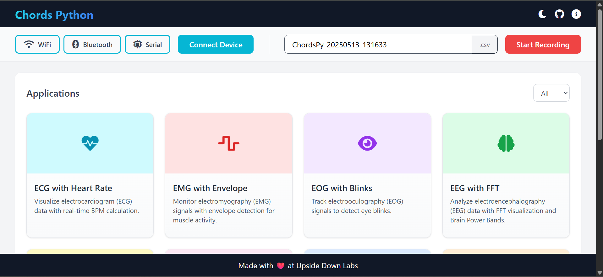

# Chords - Python

A Python script for interfacing with bio-potential amplifiers, supporting data logging as CSV, LSL streaming, real-time visualization, and HCI/BCI applications.  

> [!NOTE]  
> **Firmware Required:**  
> - For Arduino: [Chords Arduino Firmware](https://github.com/upsidedownlabs/Chords-Arduino-Firmware)  
> - For NPG-Lite: [NPG-Lite Firmware](https://github.com/upsidedownlabs/npg-lite-firmware)  

## Features  
- **Multiple Protocols**: Supports `Wi-Fi`, `Bluetooth`, and `Serial` communication.  
- **LSL Data Streaming**:Once the LSL stream starts, any PC on the same Wi-Fi network can access the data using tools like BrainVision LSL Viewer. 
- **CSV Logging**: Save raw data with Counter 
- **GUI**: Live plotting for all channels. 
- **Applications**: EEG/ECG/EMG/EOG-based games and utilities (e.g., Tug of War, Keystroke Emulator).  

## Installation  
1. **Python**: Ensure Latest version of Python is installed.  
2. **Virtual Environment**:  
   ```bash
   python -m venv venv  
   source venv/bin/activate  # Linux/macOS  
   .\venv\Scripts\activate   # Windows  
   ```  
3. **Dependencies**:  
   ```bash
   pip install -r requirements.txt  
   ```  

> [!IMPORTANT]  
> On Windows, if scripts are blocked, run:  
> ```powershell
> Set-ExecutionPolicy Unrestricted -Scope Process  
> ```  

## Usage  
Run the script and access the web interface:  
```bash
python app.py  
```  
**Web Interface Preview**:  




### Key Options:

- **LSL Streaming**: Choose a protocol (`Wi-Fi`, `Bluetooth`, `Serial`).  
- **CSV Logging**: Data saved as `ChordsPy_{timestamp}.csv`.  
- **Applications**: Multiple Applications can be Launch from the Interface simultaneously(e.g., `EEG Tug of War`). 

## Connection Guide  

#### WIFI Connection  
  1. Upload the NPG-Lite WIFI Code to your device.  
  2. Connect to the device's WIFI network.  
  3. Click the **WIFI** button in the interface, then select **CONNECT**.  
  4. Once connected, the button will change to **Disconnect**, and a pop-up will confirm: *"Connected via Wifi!"*  

#### Bluetooth Connection  
  1. Ensure Bluetooth is turned ON on your system.  
  2. Upload the Bluetooth code to your device.  
  3. Click the **Bluetooth** button to scan for available devices.  
  4. Select your device from the list and click **Connect**.
  5. Once connected, the button will change to **Disconnect**, and a pop-up will confirm: *"Connected via Bluetooth!"*  

#### Serial Connection  
  1. Ensure Bluetooth is OFF and the device is connected via USB.  
  2. Upload the required code to your hardware.  
  3. Click the **Serial** button, then select **Connect**.
  4. Once connected, the button will change to **Disconnect**, and a pop-up will confirm: *"Connected via Serial!"* 

## CSV Logging  
To save sensor data for future analysis, follow these steps:  
1. **Start Data Streaming** – Begin streaming data via **WiFi, Bluetooth, or Serial**.  
2. **Start Recording** – Click the **Start Recording** button (it will change to **Stop Recording**).  
3. **File Saved Automatically** – The data is saved as `ChordsPy_{timestamp}.csv` in your default folder.  

Visualizing CSV Data - You can plot the recorded data using the **CSV Plotter** tool.  

## Applications 
| Application                | Description                                                      |  
|----------------------------|------------------------------------------------------------------|  
| **ECG with Heart Rate**    | Real-time ECG with BPM calculation.                              | 
| **EMG with Envelope**      | Real-time EMG Visualization with Envelope.                       |
| **EOG with Blinks**        | Real-time EOG Signal visualization with Blinks marked as Red Dot.|
| **EEG with FFT**           | Real-time EEG Signal visualization with FFT and Brainpower bands.|
| **EEG Tug of War Game**    | 2 Player EEG Based Game                                          |
| **EEG Beetle game**        | Real-time EEG focus based game.                                  |
| **EOG Keystroke Emulator** | Blink detection triggers spacebar.                               |  
| **GUI**                    | Visualize raw data in real-time                                  |
| **CSV Plotter**            | Tool to plot the recorded CSV Files                              |

## Troubleshooting

- **Arduino Not Detected:** Ensure the Arduino is properly connected and powered. Check the serial port and baud rate settings.
- **CSV File Not Created:** Ensure you have write permissions in the directory where the script is run.
- **LSL Stream Issues:** Ensure that the `pylsl` library is properly installed and configured. Additionally, confirm that Bluetooth is turned off.

## How to Contribute

You can add your project to this repo:

- Add a button in apps.yaml to link your application.
- Include your script as a .py file with LSL Data Reception code.
(Pull requests welcome!)

## Contributors

We are thankful to our awesome contributors, the list below is alphabetically sorted.

- [Aman Maheshwari](https://github.com/Amanmahe)
- [Payal Lakra](https://github.com/payallakra)

The audio file used in `game.py` is sourced from [Pixabay](https://pixabay.com/sound-effects/brass-fanfare-with-timpani-and-windchimes-reverberated-146260/)